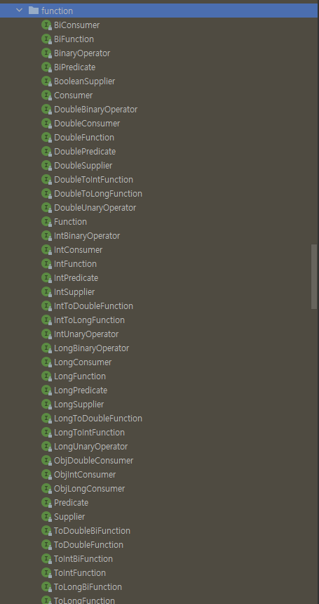

#람다

이전 동적파라미터를 설명할 때 최종적으로 람다 표현식을 사용하여 다양한 동작에도 유연한 동작이 가능해지고 코드가 훨신 짦아지고 가독성도 높아졌습니다.
이번 글에선 람다 표현식을 좀더 살펴보도록 합니다.

```java

Comparator<Apple> byWeight = new Comparator<Apple>(){
    public int compare(Apple a1, Apple a2) {
        return a1.getSize().compareTo(a2.getSize());
    }
}


Comparator<Apple> byWeight = (Apple a1, Apple a2) -> a1.getSize().compareTo(a2.getSize())
```
위는 익명클래스를 활용한 코드고, 다음은 람다표현식으로 표현한 코드입니다. 훨신 짦아지고 가독성이 높아진 것을 볼 수 있습니다. 이제 위 표현식의 어떤식으로
동작하는지 알아봅시다.

## 함수형 인터페이스
람다 표현식의 구조를 알기 전에 함수형 인터페이스에 대해 알아야 합니다.함수형 인터페이스란, 추상형 메소드가 단 하나뿐인 인터페이스를 말합니다. 예를들어

```java
public interface Predicate<T> {
    boolean test(T t);
}
```
프레디 케이트는 추상메서드가 하나뿐인 함수형 인터페이스 입니다. 여기서 test 메서드는 `시그니처` 라고 부릅니다. 그리고 시그니처를 서술하는 메서드를
`함수 디스크립터` 라고 부릅니다. 다른예를 한번 보면

```java
public interface Runnable {
    void run();
}
```
Runnable 또한 파라미터가 없고 리턴값이 void 인 함수형 인터페이스 라고 부를 수 있습니다.

```java
public void process(Runnable r) {
    r.run();    
}

process(() -> System.out.println("test!"))
```
process 는 함수형 인터페이스 Runnable 을 파라미터로 전달 받았으며, Runnable 의 동작으로 "test1" 을 출력하는 동작을 전달 하였습니다.


## 함수형 인터페이스 사용
함수형 인터페이스의 추상 메서드 시그니처를 함수 디스크립터 라고 표현합니다. 다양한 람다 표현식을 이용하기 위해 공통의 함수 디스크립터를 기술하는 함수형
인터페이스 집합이 필요합니다. 자바엔선 Predicate, Consumer, Function 등의 다양한 인터페이스를 제공하고 있습니다.

### Predicate
```java
public interface Predicate<T> {
    boolean test(T t);
}


public <T> List<T> filter(List<T> list, Predicate<T> p) {
    List<T> results = new ArrayList<>();
    for (T t: list) {
        if (p.test(t)) {
            results.add(t);
        }
    }
    return results;
}
```
Predicate는 객체를 입력으로 받고, boolean 을 리턴하는 함수형 인터페이스 입니다. filter 메서드를 정의할 때 활용 가능합니다.

### Consumer
```java
public interface Consumer<T> {
    void accept(T t );
}


public <T> void forEach(List<T> list, Consumer<T> c) {
    for(T t: list) {
        c.accept(t);
    }
}
```
Consumer 는 객체를 받아 void를 리턴하는 함수형 인터페이스 입니다. forEach 메서드를 정의할 때 유용하게 활용 할 수 있습니다.

### Function

```java

public interface Function<T, R> {
    R apply(T t);
}

public <T, R> List<R> map(List<T> list, Function<T, R> f) {
    List<R> result = new ArrayList<>(); 
    for (T t: list) {
        result.add(f.apply(t));
    }
    return result;
}
```
Function 은 제네릭 형식의 파라미터 T를 인수로 받아 R을 리턴하는 함수형 인터페이스 입니다. map 을 정의할 때 활용 가능합니다.

### 기본형 특화
위의 함수형 인터페이스는 제네릭의 특성때문에 참조형 객체밖에 받지 못합니다. 각 기본형 타입마다 매칭되는 참조형 객체가 존재하지만 (int -> Integer)
내부적으로 AutoBoxing 일으킬 수 있습니다. 이러한 오토박싱 과정은 비용이 발생하며 비싼 값을 치뤄야합니다. 

이를 피하기 위해 기본형을 지원하기 위한 함수형 인터페이스를 지원해줍니다. 




## 메서드 참조
메서드 참조를 이용하면 기존의 메서드 정의를 재활용 해서 람다처럼 전달할 수 있습니다.
```java
(Apple a1, Apple a2) -> a1.getSize().compareTo(a2.getSize())
```
위 코드는 기존 코드입니다 메서드 참조를 이용할 경우 훨간 간략하게 축약할 수 있습니다.
```java
comparing(Apple::getSize)
```
메서드 참조를 이용하면 가독성을 훨신 높일 수 있습니다.


### 메서드 참조의 유형
메서드 참조는 세가지로 나눌 수 있습니다
1. 정적 메서드 참조
 - 예를 들어 Integer parseInt 메서드는 Integer::parseInt 로 표현이 가능합니다
2. 다양한 형식의 인스턴스 메서드 참조
 - String 의 length 메서드는 String::length 로 표현할 수 있습니다.
3. 기존 객체의 인스턴스 메서드 참조 
 - Transaction 객체를 할당받은 expensiveTransaction 지역 변수가 있고, transaction 객체에는 getValue 메서드가 있다면, 이를 expensiveTransaction::getValue 라고
표현할 수 있습니다.

### 생성자 참조
ClassName::new 처럼 클래스명과 new 키워드랄 사용해 기존 생성자는 참조를 만들 수 있습니다.
```java
1.Supplier<Apple> c1 = Apple::new
2. Supplier<Apple> c2 = () -> new Apple();
```
위 두개의 코드는 같은 기능합니다. 여기서 생성자 참조를 활용해 Apple::new 라는 표현식으로 변경할 수 있습니다.

